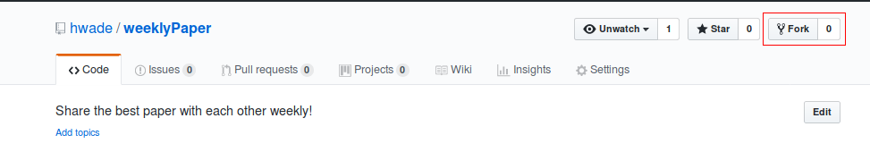
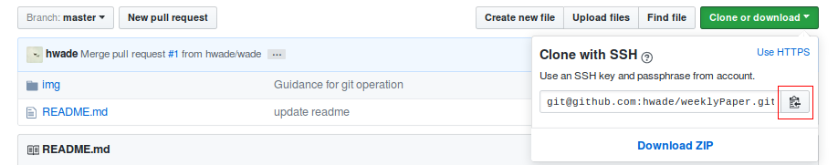

# Weekly Paper

Share the best paper you have read with each other weekly.

## Guidance

- Prepare your paper to share, and make a PowerPoint file to share your ideas.

- Transfer the *.pptx file to *.pdf file. ([Template](week-0/template.pdf)) 

- Pull request from your branch to add your *.pdf file to the project.

## How to join the project

- **Fork** this repository by clicking the "fork" button (**Not Necessary**).



- **Clone** this repository.

```
$ git clone git@github.com:hwade/weeklyPaper.git 
```



- **Add** this remote repository url at the first time.

```
$ git remote add origin git@github.com:hwade/weeklyPaper.git
```

- **Create** new branch.

```
$ git checkout -b <BRANCH>
```

- **Pull Request** your local update to this repository at new branch.

```
$ git checkout <BRANCH>
$ git add *.pdf
$ git commit -m 'your comment'
$ git push origin <BRANCH>
```

- **Fetch** and **Merge** from the remote repository when there has new updates from remote.
```
$ git fetch origin master
$ git merge
```

- **Git Operation Overview**


